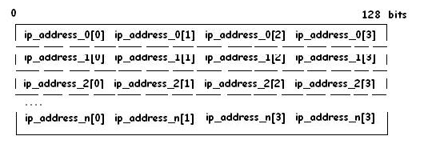
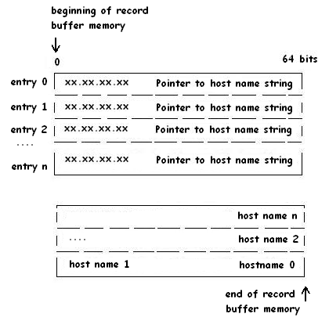

# Chapter 1 - Introduction to the NetX Duo DNS Client

The DNS provides a distributed database that contains mapping between domain names and physical IP addresses. The database is referred to as *distributed* because there is no single entity on the Internet that contains the complete mapping. An entity that maintains a portion of the mapping is called a DNS Server. The Internet is composed of numerous DNS Servers, each of which contains a subset of the database. DNS Servers also respond to DNS Client requests for domain name mapping information, only if the server has the requested mapping.

The DNS Client protocol for NetX Duo provides the application with services to request mapping information from one or more DNS Servers.

## DNS Client Setup

In order to function properly, the DNS Client package requires that a NetX Duo IP instance has already been created.

After creating the DNS Client, the application must add one or more DNS servers to the server list maintained by the DNS Client. To add DNS servers, the application uses the *nxd_dns_server_add* service. The NetX Duo DNS Client service *nx_dns_server_add* can also be used to add servers. However it only accepts IPv4 addresses and it is recommended that developers use the *nxd_dns_server_add* service instead.

If the NX_DNS_IP_GATEWAY_SERVER option is enabled, and the IP instance gateway address is non zero, the IP instance gateway is automatically added as the primary DNS server. If DNS server information is not statically known, it may also be derived through the Dynamic Host Configuration Protocol (DHCP) for NetX Duo. Please refer to the NetX Duo DHCP User Guide for more information.

The DNS Client requires a packet pool for transmitting DNS messages. By default, the DNS Client creates this packet pool when the *nx_dns_create* service is called. The configuration options NX_DNS_PACKET_PAYLOAD_UNALIGNED and NX_DNS_PACKET_POOL_SIZE allow the application to determine the packet payload and packet pool size (e.g. number of packets) of this packet pool respectively. These options are described in section "Configuration Options" in Chapter Two.

An alternative to the DNS Client creating its own packet pool is for the application to create the packet pool and set it as the DNS Client's packet pool using the *nx_dns_packet_pool_set* service. To do so, the NX_DNS_CLIENT_USER_CREATE_PACKET_POOL option must be defined. This option also requires a previously created packet pool using *nx_packet_pool_create* as the packet pool pointer input to *nx_dns_packet_pool_set* . When the DNS Client instance is deleted, the application is responsible for deleting the DNS Client packet pool if NX_DNS_CLIENT_USER_CREATE_PACKET_POOL is enabled if it is no longer needed.

> **Note:** For applications choosing to provide its own packet pool using the NX_DNS_CLIENT_USER_CREATE_PACKET_POOL option, the packet size needs to be able to hold the DNS maximum massage size (512 bytes) plus rooms for UDP header, IPv4 or IPv6 header, and the MAC header.

## DNS Messages

The DNS has a very simple mechanism for obtaining mapping between host names and IP addresses. To obtain a mapping, the DNS Client prepares a DNS query message containing the name or the IP address that needs to be resolved. The message is then sent to the first DNS server in the server list. If the server has such a mapping, it replies to the DNS Client using a DNS response message that contains the requested mapping information. If the server does not respond, the DNS Client queries the next server on its list until all its DNS servers have been queried. If no response from all its DNS servers is received, the DNS Client has retry logic to retransmit the DNS message. On resending a DNS query, the retransmission timeout is doubled. This process continues until the maximum transmission timeout (defined as NX_DNS_MAX_RETRANS_TIMEOUT in *nxd_dns.h*) is reached or until a successful response is received from that server is obtained.

NetX Duo DNS Client can perform both IPv6 address lookups (type AAAA) and IPv4 address lookups (type A) by specifying the version of the IP address in the *nxd_dns_host_by_name_get* call. The DNS Client can perform reverse lookups of IP addresses (type PTR queries) to obtain web host names using *nxd_dns_host_by_address_get*. The NetX Duo DNS Client still supports the *nx_dns_host_by_name_get* and *nx_dns_host_by_address_get* which are the equivalent services but which are limited to IPv4 network communication. However, developers are encouraged to port existing DNS Client applications to the *nxd_dns_host_by_name_get* and *nxd_dns_host_by_address_get* services.

DNS messaging utilizes the UDP protocol to send requests and field responses. A DNS Server listens on port number 53 for queries from clients. Therefore UDP services must be enabled in NetX Duo using the ***nx_udp_enable*** service on a previously created IP instance (***nx_ip_create***).

At this point, the DNS Client is ready to accept requests from the application and send out DNS queries.

## Extended DNS Resource Record Types

If NX_DNS_ENABLE_EXTENDED_RR_TYPES is enabled, NetX Duo DNS Client also supports the following record type queries:

- CNAME: contains the canonical name for an alias
- TXT: contains a text string
- NS: contains an authoritative name server
- SOA: contains the start of a zone of authority
- MX: used for mail exchange
- SRV: contains information on the service offered by the domain

With the exception of CNAME and TXT record types, the application must supply a 4-byte aligned buffer to receive the DNS data record.

In NetX Duo DNS Client, record data is stored in such a way to make most efficient use of buffer space.

An example of a record buffer of fixed length (type AAAA record) is shown below:



For those queries whose record types have variable data length, such as NS records whose host names are of variable length, NetX Duo DNS Client saves the data as follows. The buffer supplied in the DNS Client query is organized into an area of fixed length data and an area of unstructured memory. The top of the memory buffer is organized into 4-byte aligned record entries. Each record entry contains the IP address and a pointer to the variable length data for that IP address. The variable length data for each IP address are stored in the unstructured area memory starting at the end of the memory buffer. The variable length data for each successive record entry is saved in the next area memory adjacent to the previous record entries variable data. Hence, the variable data 'grows' towards the structured area of memory containing the record entries until there is insufficient memory to store another record entry and variable data.

This is shown in the figure below:



The example of the DNS domain name (NS) data storage is shown above.

NetX Duo DNS Client queries using the record storage format return the number of records saved to the record buffer. This information enables the application to extract NS records from the record buffer.

An example of a DNS Client query that stores variable length DNS data using this record storage format is shown below:

```C
UINT  _nx_dns_domain_name_server_get(NX_DNS *dns_ptr, 
                    UCHAR *host_name, VOID *record_buffer, 
                    UINT buffer_size, UINT *record_count, 
                    ULONG wait_option);
```


More details are available in Chapter 3, "Description of DNS Client Services".

## DNS Cache

If NX_DNS_CACHE_ENABLE is enabled, NetX Duo DNS Client supports the DNS Cache feature. After creating the DNS Client, the application can call the API *nx_dns_cache_initialize()* to set the special DNS Cache. If enable DNS Cache feature, DNS Client will find the available answer from DNS Cache before starts to send DNS query, if find the available answer, directly return the answer to application, otherwise DNS Client sends out query message to DNS server and waits for the reply. When DNS Client gets the response message and there is free cache available, DNS Client returns the answer to the application and also adds the answer as resource record into DNS cache.

Each answer a data structure *NX_DNS_RR* (Resource Record) in the cache. Strings (resource record name and data) in Records are variable length, therefore are not stored in the NX_DNS_RR structure. The Record contains pointers to the actual memory location where the strings are stored. The string table and the Records share the cache. Records are stored from the beginning of the cache, and grow towards the end of the cache. The string table starts from the end of the cache and grows towards the beginning of the cache. Each string in the string table has a length field and a counter field. When a string is added to the string table, if the same string is already present in the table, the counter value is incremented and no memory is allocated for the string. The cache is considered full if no more resource records or new strings can be added to the cache.

## DNS Client Limitations

The DNS Client supports one DNS request at a time. Threads attempting to make another DNS request are temporarily blocked until the previous DNS request is complete.

The NetX Duo DNS Client does not use data from authoritative answers to forward additional DNS queries to other DNS servers.

## DNS RFCs

NetX Duo DNS is compliant with the following RFCs:

- RFC1034 DOMAIN NAMES - CONCEPTS AND FACILITIES
- RFC1035 DOMAIN NAMES - IMPLEMENTATION AND SPECIFICATION
- RFC1480 The US Domain
- RFC 2782 A DNS RR for specifying the location of services (DNS SRV)
- RFC 3596 DNS Extensions to Support IP Version 6